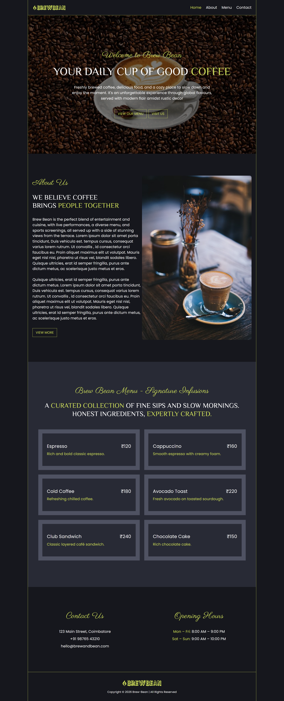
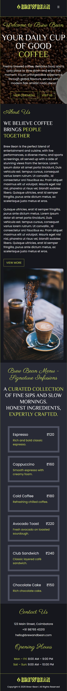

# Brew Bean — Coffee Landing Page

A modern and responsive coffee bean landing page built with React.

## Live Demo

[View Live Website](https://brew-bean-landing.vercel.app/)

## Preview

### Desktop



### Mobile



## Features

- Responsive design for desktop, tablet, and mobile
- Mobile-friendly navigation menu
- Smooth page scrolling
- Modern coffee-themed UI
- Reusable React components
- Responsive layout
- Clean and simple user interface

## Tech Stack

- React
- JavaScript
- CSS
- Tailwind Css
- Vite
- Git & GitHub
- Vercel

## Responsive Design

The website is designed to provide a smooth experience across:
- Desktop
- Mobile
- Tablet

## Project Structure

```text
src/
├── components/
├── assets/
├── App.jsx
└── main.jsx

public/